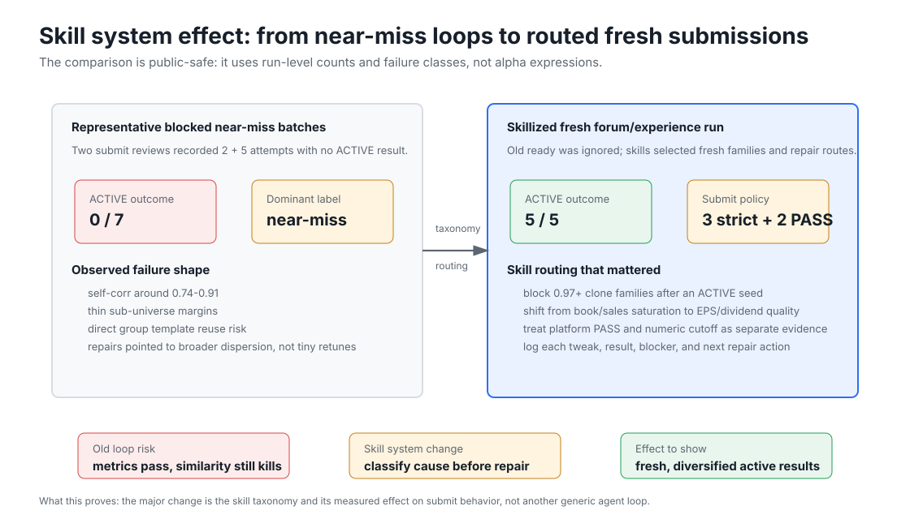
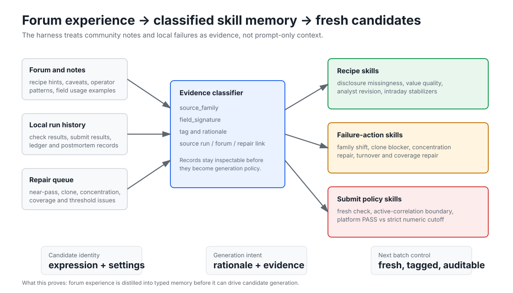
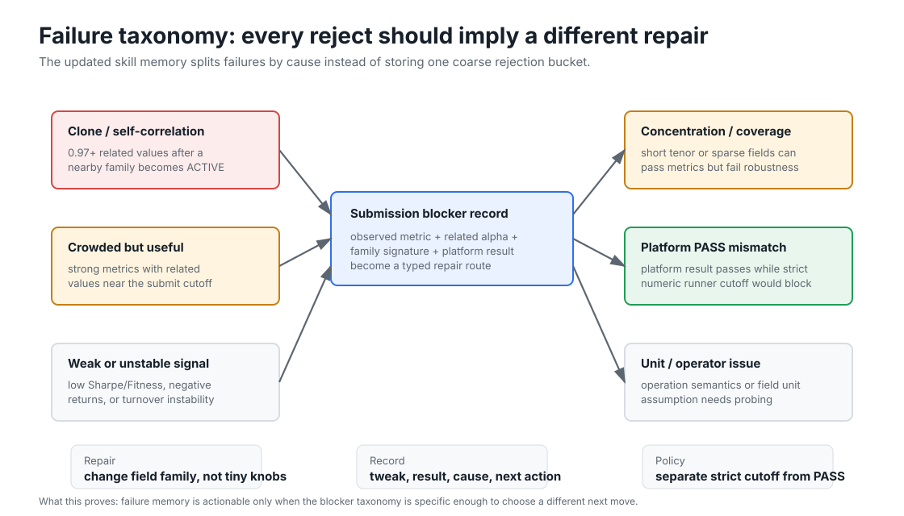
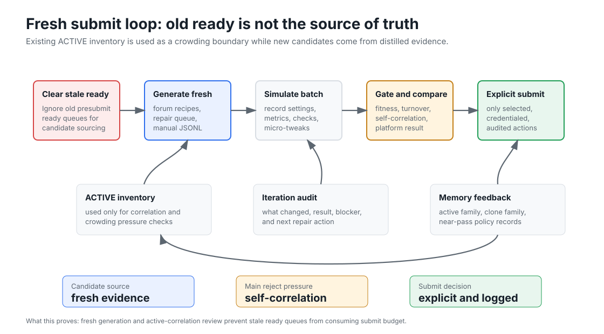
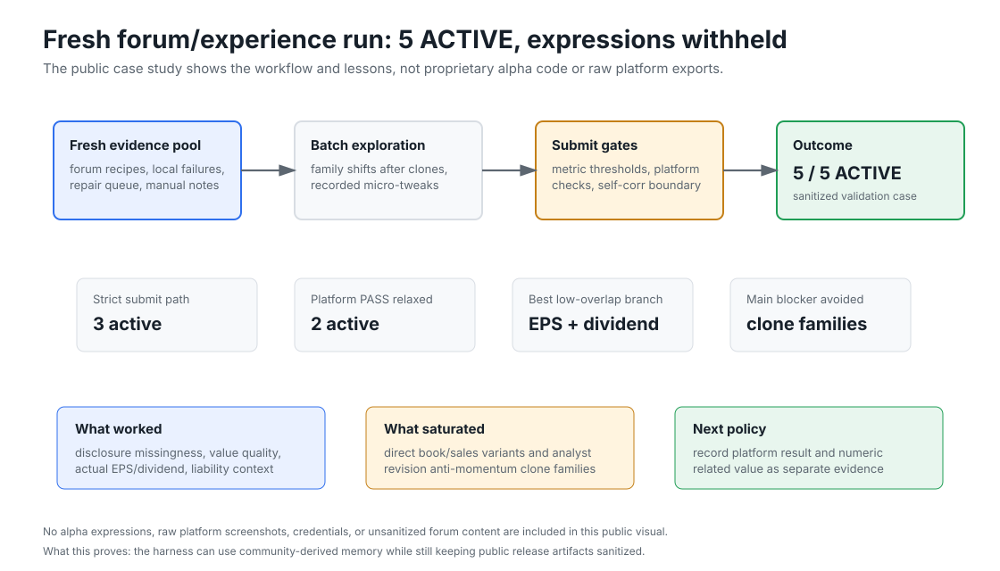

# worldquant-harness Visual Guide

This guide combines generated public-demo visuals with curated public-safe skill/effect visuals. It is designed as the fastest path for a new reader to understand worldquant-harness as an agent research harness with memory feedback, forum-derived skill memory, and explicit submit boundaries.

## Start Here


What this proves: worldquant-harness is a reproducible loop around agent research, presubmit gates, memory, quality review, and profile evolution.

## System Architecture


What this proves: agent entrypoints, harness gates, memory feedback, and the credentialed submit boundary are separate layers.

## Skill System Effect



What this proves: the major recent change is the skill taxonomy and its measured effect on submit behavior. Representative blocked near-miss reviews are compared with a later fresh skill-routed run, without exposing alpha expressions.

## Forum To Skill Memory



What this proves: forum notes, local submit history, manual candidates, and repair records are classified into reusable skill memory before they drive generation.

## Failure Taxonomy



What this proves: self-correlation, clone, concentration, weak metric, platform mismatch, and unit/operator issues imply different repair actions.

## Fresh Submit Loop



What this proves: old ready rows are not treated as the source of truth; fresh candidates are generated from evidence while ACTIVE inventory is used as a correlation boundary.

## Submit5 Case Study



What this proves: a sanitized 5 ACTIVE run can be shown as workflow evidence while withholding alpha expressions, raw platform exports, and unsanitized forum content.

## Artifact Lifecycle


What this proves: every agent decision is persisted as an auditable artifact before any submit-capable command can be used.

## Public Demo Trace


The demo funnel is candidates 5 -> simulated 3 -> ready 1 -> submitted 0. The stable `candidate_uid` links lifecycle events across artifacts.

## Memory Feedback


What this proves: failures and blockers are converted into structured memory instead of being lost in logs.

## Factor Map


What this proves: field signatures, source families, and self-correlation pressure make the next synthesis direction explainable.

## Quality Review


What this proves: a time window of generated and submitted alpha quality can be reviewed before changing the research profile.

## Profile Evolution


What this proves: the next agent profile is a tracked artifact derived from harness metrics.

## Submit Boundary


What this proves: public demo, sandbox, and presubmit paths are no-submit by default; real submission requires explicit commands and user credentials.

## Release Boundary


What this proves: the public repository should publish the harness and synthetic demo while keeping credentials, raw platform exports, and private research ledgers out of Git.

## Reproduce

```powershell
python scripts/run_public_harness_demo.py --output-root reports/public_harness_demo
python scripts/validate_public_harness_artifacts.py reports/public_harness_demo
python scripts/wq_submit_efficiency_report.py `
  --run-roots reports/public_harness_demo `
  --current-name public-demo `
  --output reports/public_harness_demo/efficiency_summary.json `
  --markdown-output reports/public_harness_demo/efficiency_summary.md `
  --events-output reports/public_harness_demo/efficiency_events.jsonl
python scripts/wq_alpha_quality_review.py `
  --reports reports/public_harness_demo `
  --no-platform `
  --no-profile-candidate `
  --output-dir reports/public_harness_demo/quality_review
python scripts/build_public_visual_pack.py --source reports/public_harness_demo --output-dir docs/images --report reports/public_harness_demo/generated_visual_guide.md
```

The public-demo command regenerates the demo-derived visuals. The skill/effect visuals in this guide are curated static SVGs because their source evidence comes from sanitized local submit reviews and postmortems that should not be published verbatim.

## Artifact To Visual Map

| Artifact | Visual use |
| --- | --- |
| `demo_summary.json` | overview, submit guard, experiment identity |
| `candidate_specs.jsonl` | candidate count, field map, lifecycle start |
| `presubmit_run/presubmit_ready_sequential.jsonl` | ready lane and accepted candidates |
| `presubmit_run/presubmit_rejected.jsonl` | rejection reasons and blocker memory |
| `evaluations/<eval-id>/eval_summary.json` | harness score, reject counts, field signatures |
| `evaluations/<eval-id>/evolution_result.json` | profile candidate and next experiment |
| `efficiency_summary.json` | candidate_uid funnel and source-family leaderboards |
| `quality_review/summary.json` | period quality dashboard and self-correlation pressure |
| `quality_review/recommended_directions.json` | next synthesis direction callouts |
| Sanitized submit reviews | skill effect comparison and submit5 case study |
| Iteration audit summaries | failure taxonomy, tweak effect, and next-action callouts |
| Community skill memory records | forum-to-skill-memory routing and skill taxonomy |
| `SECURITY.md`, `.gitignore`, release checklist | submit boundary and release boundary |

## Current Artifact Availability

| Artifact | Status |
| --- | --- |
| `candidate_specs` | available |
| `demo_summary` | available |
| `efficiency_summary` | available |
| `eval_summary` | available |
| `evolution_result` | available |
| `quality_summary` | available |
| `ready` | available |
| `recommended_directions` | available |
| `rejected` | available |

The generated visuals intentionally avoid absolute local paths and private credential material.
